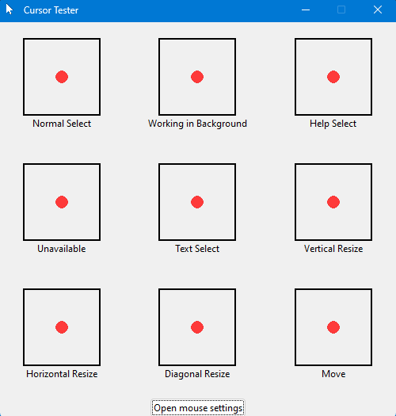

# CursorTester.exe
A minimalist software built with Tkinter that allows users to test and compare different cursor styles.

## Preview

## Installation
To download the software, click here : [CursorTester.exe](https://github.com/Cosmow22/cursor-tester/releases/download/1.0/CursorTester.exe)

To dowload additional cursors, visit : 
https://www.rw-designer.com/cursor-library

Recommended cursor set : 
https://www.rw-designer.com/cursor-set/fluent-light-blue

## How to use
1. Launch CursorTester.exe
2. Hover over the interface to preview cursors
3. Click the button to open mouse settings and change your cursor

## License
This project is under MIT license.
Feel free to use, modify, and distribute the code as you wish.
